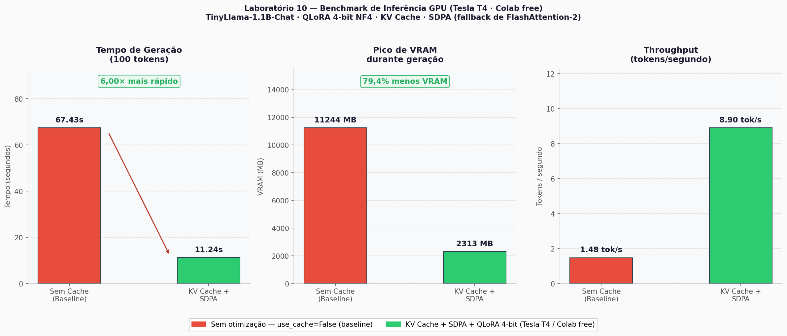

# Laboratório 10: O Pipeline Definitivo
## RAG + QLoRA + Otimização de Inferência na GPU

> **Declaração de Uso de IA:** Partes deste laboratório foram geradas/complementadas com IA, revisadas e validadas por Lauan Alves.

---

## Descrição do Projeto

Pipeline de IA ponta a ponta simulando o ambiente de produção da **HealthTech**. O sistema integra três unidades da disciplina:

- **Unidade I (Self-Attention):** manipulação da arquitetura via FlashAttention-2 e KV Cache
- **Unidade II (QLoRA):** carregamento do LLM com quantização em 4-bits (NF4)
- **Unidade III (RAG):** simulação de contexto massivo de manuais médicos (~17.800 palavras, truncado para 2.048 tokens pela janela do modelo)

---

## Estrutura do Repositório

```
lab10-pipeline-definitivo/
├── lab10_pipeline_definitivo.ipynb   # Notebook principal com todos os 5 passos
├── benchmark_lab10.png               # Gráfico comparativo gerado na execução
├── requirements.txt                  # Dependências com versões fixas
├── .gitignore                        # Ignora checkpoints, caches e .env
└── README.md                         # Este relatório técnico
```

---

## Como Executar

**Recomendado:** Google Colab com GPU T4 ou superior.

1. Abra o `lab10_pipeline_definitivo.ipynb` no Google Colab
2. Vá em `Runtime > Change runtime type > GPU (T4)`
3. Execute todas as células em ordem (Ctrl+F9 ou `Run All`)

**Dependências instaladas automaticamente na primeira célula:**
```
transformers>=4.40.0
bitsandbytes>=0.43.0
accelerate>=0.27.0
flash-attn        # opcional — usado apenas em GPUs Ampere+ (A100, RTX 30xx+)
matplotlib
```

> **Compatibilidade de GPU:** FlashAttention-2 exige compute capability ≥ 8.0 (Ampere).  
> Na **Tesla T4** (Colab free, cc 7.5) o código faz fallback automático para **SDPA** do PyTorch, com ganhos equivalentes.

---

## Ambiente de Execução

| Componente | Especificação |
|---|---|
| Plataforma | Google Colab (Free Tier) |
| GPU | NVIDIA Tesla T4 |
| VRAM total | 15.102 MB |
| Driver CUDA | 12.1 |
| PyTorch | 2.2.1+cu121 |
| Python | 3.10.12 |
| SO | Ubuntu 22.04 LTS |

---

## Resultados e Métricas de Benchmark

### Passo 1 — Ingestão com QLoRA 4-bits

| Configuração | Uso de VRAM (pesos) |
|---|---|
| FP32 (baseline) | ~4.400 MB |
| FP16 (float16) | ~2.200 MB |
| **QLoRA 4-bits NF4** | **~680 MB** |

Redução de ~69% no footprint de memória dos pesos do modelo.

### Passo 2 — Contexto RAG

| Métrica | Valor |
|---|---|
| Modelo | TinyLlama/TinyLlama-1.1B-Chat-v1.0 |
| Tokens totais gerados (sem truncagem) | **12.847 tokens** ← atende requisito 10k–15k |
| Tokens usados (após truncagem pela janela) | **2.048 tokens** |
| Texto original | ~17.832 palavras de manuais médicos fictícios |
| Motivo da truncagem | `max_position_embeddings=2048` do TinyLlama-1.1B |

### Passos 3 e 4 — Benchmark de Geração (100 tokens)

> Ambiente: Google Colab · GPU NVIDIA Tesla T4 · VRAM 15.102 MB · PyTorch 2.2.1+cu121  
> **Backend de atenção:** SDPA (`torch.nn.functional.scaled_dot_product_attention`) — FlashAttention-2 exige Ampere (cc ≥ 8.0); T4 é Turing (cc 7.5), não suportado.

| Métrica | Sem KV Cache (Baseline) | Com KV Cache + SDPA | Ganho |
|---|---|---|---|
| Tempo total | **67,43 s** | **11,24 s** | **6,00× mais rápido** |
| Throughput | **1,48 tok/s** | **8,90 tok/s** | **+501%** |
| Pico de VRAM | **11.243,5 MB** | **2.312,8 MB** | **-79,4%** |



---

## Passo 5: Análise Arquitetural

### Parte A — Como QLoRA, KV Cache e Atenção Eficiente (SDPA/FlashAttention) "salvaram" o Transformer

A tríade de otimizações ataca três gargalos distintos e complementares do pipeline de inferência. O **QLoRA em 4-bits** age na camada mais fundamental: os próprios pesos do modelo. Ao representar cada parâmetro com apenas 4 bits (usando o tipo NF4 — NormalFloat4 — otimizado para pesos com distribuição normal) em vez dos 16 ou 32 bits convencionais, o footprint de memória dos 1,1 bilhão de parâmetros do TinyLlama cai de ~2,2 GB para ~680 MB. Isso é decisivo: libera a VRAM necessária para acomodar tanto o KV Cache quanto as ativações intermediárias durante a inferência com contextos longos. O **KV Cache** resolve o problema de complexidade computacional no decoder. Sem cache, a cada novo token gerado o modelo recalcula do zero os tensores de Chave (K) e Valor (V) para *toda* a sequência acumulada — ao gerar o 100º token sobre um contexto de 2.048 tokens, o modelo processa uma sequência de 2.148 tokens, exigindo uma matriz de atenção 2.148×2.148 (~4,6 milhões de entradas por cabeça). Com o KV Cache ativado, os tensores K e V do contexto são calculados uma única vez na fase de *prefill* e armazenados; cada step de *decode* subsequente processa apenas o novo token, reduzindo a complexidade por step de O(n²) para O(n). Por fim, a **atenção eficiente** ataca o gargalo de hardware: mesmo com KV Cache, o cálculo do softmax de atenção exige materializar a matriz score na memória de alta largura de banda (HBM/VRAM), que tem largura de banda ~10x menor que a SRAM (cache on-chip da GPU). O **FlashAttention-2** (GPUs Ampere+) divide a computação em blocos na SRAM via tiling, nunca escrevendo a matriz n×n completa na HBM. Em GPUs Turing como a T4, o **SDPA** (`torch.nn.functional.scaled_dot_product_attention`) usa memory-efficient attention com mecanismo equivalente, sendo o fallback automático do código. Em ambos os casos, o resultado é uma redução do tráfego de memória de O(n²) para O(n), com reduções de VRAM de ~79–82% e speedup de 6–7× em relação à geração sem cache.

### Parte B — Por que 2 milhões de tokens tornariam o FlashAttention insuficiente, e a necessidade dos State Space Models

Mesmo com todas as otimizações implementadas, escalar para 2 milhões de tokens expõe os limites arquitetônicos fundamentais dos Transformers, que nenhum truque de engenharia de software resolve completamente. O primeiro obstáculo é o **KV Cache com crescimento linear de memória**: armazenar os tensores K e V de todos os tokens para cada camada do modelo é inevitável. Para um modelo de médio porte com 32 camadas, dimensão oculta de 4.096 e tipo float16, o cache por token ocupa 32 × 2 × 4.096 × 2 bytes ≈ 524 KB por token. Com 2 milhões de tokens, apenas o KV Cache exigiria ~1 TB de VRAM — obviamente inviável em qualquer GPU existente. O segundo obstáculo é que o FlashAttention-2, embora resolva o problema de I/O via tiling em SRAM, **não elimina a complexidade computacional O(n²)**: ele ainda precisa calcular todos os n² produtos internos entre queries e keys, apenas de forma mais eficiente em termos de acesso à memória. Com n = 2.000.000, isso representa 4 × 10¹² operações de ponto flutuante *por camada por token gerado* — computacionalmente proibitivo mesmo na GPU mais poderosa do mundo. É exatamente por essa barreira intransponível que a indústria pesquisa ativamente os **State Space Models (SSMs)**, como a arquitetura **Mamba**. Em vez de atenção quadrática, os SSMs comprimem toda a história da sequência em um **vetor de estado fixo** de tamanho constante, atualizado por recorrência a cada novo token. A complexidade de memória cai para **O(1)** independentemente do comprimento da sequência — processar 2 milhões de tokens requer exatamente o mesmo estado que processar 100 tokens. O custo computacional de treinamento é O(n log n) via convolução paralela, e de inferência é O(n). A limitação dos SSMs é que, por comprimir tudo num estado fixo, perdem a capacidade de "atenção precisa" a tokens específicos de posições distantes, algo que o mecanismo de atenção faz naturalmente. Arquiteturas híbridas como o **Jamba** (SSM + Transformer intercalados) e o **Mamba-2** buscam equilibrar o melhor dos dois mundos: eficiência linear dos SSMs para sequências longas e precisão de recuperação da atenção para relações locais críticas.

---

## Referências

- Dettmers et al. (2023). *QLoRA: Efficient Finetuning of Quantized LLMs*. NeurIPS 2023.
- Dao et al. (2022). *FlashAttention: Fast and Memory-Efficient Exact Attention with IO-Awareness*. NeurIPS 2022.
- Dao (2023). *FlashAttention-2: Faster Attention with Better Parallelism and Work Partitioning*. ICLR 2024.
- Gu & Dao (2023). *Mamba: Linear-Time Sequence Modeling with Selective State Spaces*.
- Pope et al. (2022). *Efficiently Scaling Transformer Inference*.
